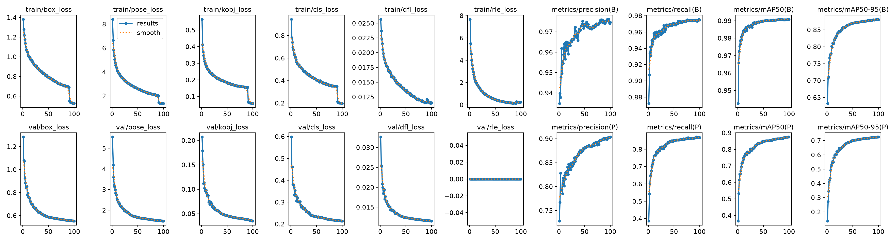
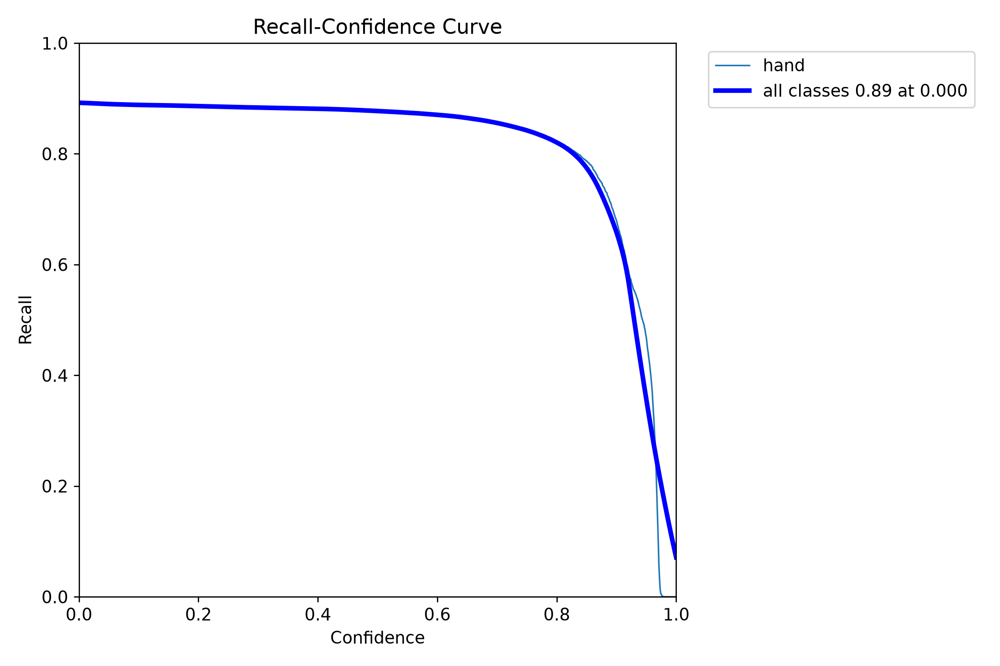

\### 1. Hardware Profiling \& Resource Metrics

\* Allocated Target Computing Device: NVIDIA RTX 4060 Laptop

\* Configured Execution Batch Size: batch=8

\* Absolute Processing Duration Spent Per Epoch: 6 minutes

\### 2. Performance Tracking Metrics Ledger (Best Validated Checkpoint)

\* Overall Training Budget Epochs Completed: 100/100

\* Box Loss (box\_loss): 0.55683

\* Pose Loss (pose\_loss): 1.48992

\* Class Loss (cls\_loss): 0.211528

\* Tracking Precision Score (Pose mAP50): 0.89872

\* Rigorous Generalization Bound Score (Pose mAP50-95): 0.87071

\### 3. Optimization and Loss Landscape Analysis

\*Paste or embed an image snapshot of your custom Train Loss vs. Validation Loss curves from your Weights \& Biases cloud dashboard here.\*

